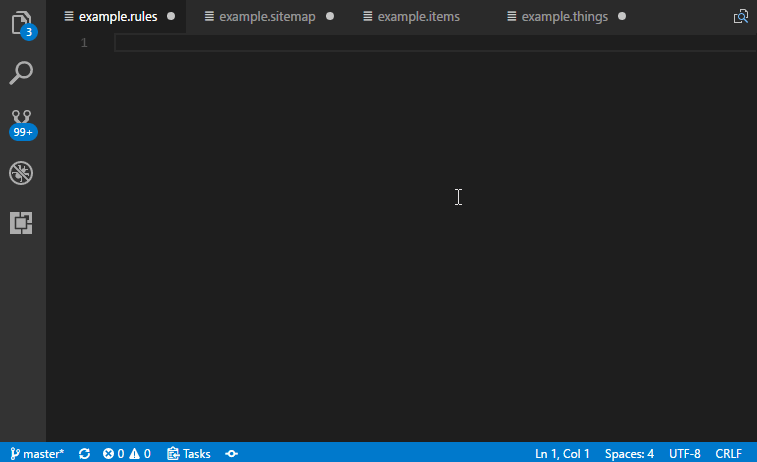



# Editors - Different Ways to Simplify Your Textual Configuration

Currently there are several existing solutions, that can help you configuring your openHAB instance in a textual way.
This documentation page can give you some guidance in choosing the right one for you and setting it up.

{::options toc_levels="2..4"/}

- TOC
{:toc}

## Network Preparations

Any editors used to configure openHAB need to be able to access the configuration files on the remote openHAB host.

This can be achieved by using a [network share](https://en.wikipedia.org/wiki/Shared_resource) set up on the remote host and mounted on your local computer.
The steps required to set up a [network share](https://en.wikipedia.org/wiki/Shared_resource) on your local host computer are specific to the host operation system.
How to setup and use Samba on a Linux system is described in the [Linux article]({{base}}/installation/linux.html#network-sharing).
If you are using [openHABian]({{base}}/installation/openhabian.html), the network shares are readily configured for you, you only need to mount them locally.

*Attention Windows users:* Directly accessing network shares (UNC paths) is often not supported. Please be sure to mount the network share to a drive letter.

{: #openhab-vscode}

## openHAB VS Code Extension

openHAB VS Code is an extension for the [Visual Studio Code](https://code.visualstudio.com) editor.
You can find it in the [Microsoft Visual Studio Marketplace](https://marketplace.visualstudio.com/items?itemName=openhab.openhab).

  

### Installation

1. Install [Visual Studio Code](https://code.visualstudio.com/Download) on your desktop computer (not on the openHAB host)
1. Open the extension sidebar.
  
1. Search for openHAB and install the extension.

[Visit the Extensions GitHub Page for further Informations](https://github.com/openhab/openhab-vscode/blob/master/README.md "GitHub Repo for the VS Code Extension")

### Rule Validation

This extension has the ability to check rules and validate them through a so called `Language Server`.
(If you want to know more about this in general look [here](https://langserver.org/).)
The validation needs a running openHAB installation in your environment and can be activated with some simple steps.
You can find all important information in the extensions [readme file](https://github.com/openhab/openhab-vscode#validating-the-rules).

{: #others}

## Other Editor Integrations

The here summarized projects provide syntax highlighting for different text editors, but have no _on top_ functionality.

### mcedit
### mcedit
# yo hey
mcedit is an editor which comes with mc (Midnight Commander).
You can find the syntax files and installation instructions on [openhab-mcedit](https://github.com/CWempe/openhab-mcedit).

{: #notepadpp}

### Notepad++

Notepad++ is a free source code editor for Windows.
Version 6.2 or above is required.
You can find the syntax files on [openhab-samples](https://github.com/thefrip/openhab-samples) and install the files like it is described in the [notepad++ user manual](https://npp-user-manual.org/docs/user-defined-language-system/).

### Vim

Vim is a text editor in Linux systems.
You can find the syntax file and installation instructions on [openhab-vim](https://github.com/cyberkov/openhab-vim).

### Nano

Nano is a common editor in Linux systems.
You can find the syntax file and installation instructions on [openhabnano](https://github.com/airix1/openhabnano).

### TextWrangler

TextWrangler is a text and code editor for macOS.
You can find the syntax file and installation instructions on [openhab-syntax-textwrangler](https://github.com/GrisoMG/openhab-syntax-textwrangler).

### BBEdit

BBEdit is a text and code editor for macOS and the offical successor of TextWrangler.
You can find the syntax file and installation instructions on [BBEdit-openHAB-language](https://github.com/mjmeijer/BBEdit-openHAB-language).
